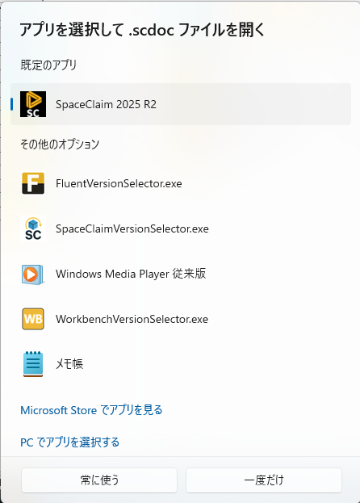
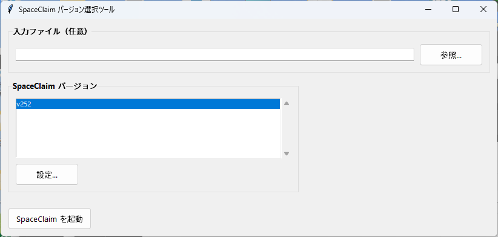
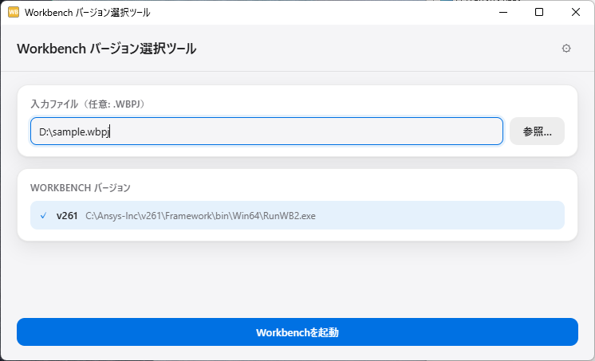
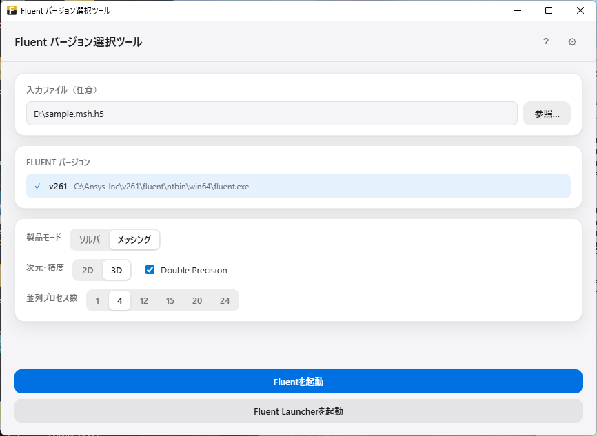
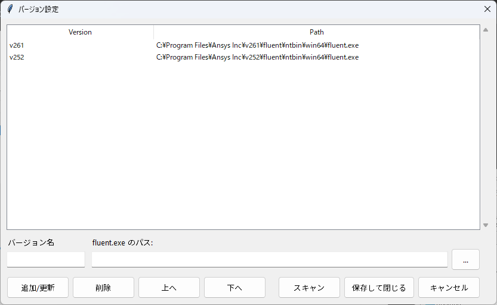

+++
title = "Ansysのバージョン選択ツールの作成｜古い解析ファイルを別バージョンで開くリスクを減らす"
date = 2026-03-18T11:00:00+09:00
draft = false
description = "Ansysを複数バージョン運用している環境で、意図しない版で解析ファイルを開くリスクを減らすために作ったバージョン選択ツールを紹介。Fluent・SpaceClaim・Workbenchに対応。"
image = 'Fluent.png'
tags = ["Ansys", "Fluent", "Workbench", "SpaceClaim", "Python"]
categories = ["プロジェクト"]
slug = "ansys-version-selector"
+++

GitHub: [mitz17/ANSYS_Version_Selector](https://github.com/mitz17/ANSYS_Version_Selector)  
このツールは GitHub で公開している。  
この記事で紹介するツールは個人が作成した非公式ツールであり、Ansys の公式製品・公式サポートとは一切無関係である。

## 目次

- [作った理由](#作った理由)
- [ツールの使い方](#ツールの使い方)
  - [バージョンの手動検出](#バージョンの手動検出)
- [コードの解説](#コードの解説)
  - [ANSYSのインストール先を探す処理](#ansysのインストール先を探す処理)
  - [SpaceClaim・Workbenchを起動する処理](#spaceclaimworkbenchを起動する処理)
  - [Fluentを起動する処理](#fluentを起動する処理)
- [さいごに](#さいごに)
- [関連記事](#関連記事)


## 作った理由

私のPCには、ANSYS関連ソフト(Fluent、SpaceClaim、Workbench) が**複数バージョンインストールされている**。

ANSYS関連ソフトは俗に言う「**後方互換性はあるが、前方互換性はない**」仕様となっている。  
新しいバージョンのソフトでは古いファイルを読めるが、新しいソフトで保存したファイルは古いバージョンのソフトで読むことはできない。  
だから、ANSYSファイルを開いたり上書き保存するときには細心の注意を払う必要がある。(n敗)

しかし、ANSYSとWindows標準の機能のみでは、好きなバージョンを選択してファイルを開くことは難しい。(少なくとも私の環境では)  
図のようにプログラムから開くを選択しても、1つのバージョンしか表示されない。`PCでアプリを選択する`を押して、別バージョンのexeファイルを選択しても一覧に表示されないことが多い。  
表示されたとしても指定したバージョンと別のバージョン(規定のバージョン)で勝手に開かれてしまう。(非常に不思議な仕様である)

<div style="text-align: center;"></div>
<p style="text-align: center;">図1　Windowsのアプリ選択画面</p>

そこで、`Fluent`、`SpaceClaim`、`Workbench` を「**どのバージョンで開くか**」を**明示的に選べる**ツールをつくった。

## ツールの使い方
1. [GitHub](https://github.com/mitz17/ANSYS_Version_Selector)のリリースのページから最新版のexeファイル一式をダウンロードする（ソースコードから自分でexe化してもよい）
2. 好きな場所に保存する（例: C:\CombinedAnsysLauncher 直下）
3. ANSYSファイルの拡張子をFluentVersionSelector.exe、SpaceClaimVersionSelector.exe、WorkbenchVersionSelector.exeのどれかに関連付けてwindowsの規定で開くように設定する
4. 関連付けた状態でANSYSファイルをダブルクリックで開く
5. 下図のようなGUIが開く。入力ファイルに開きたいファイルが表示されていることを確認する
6. 自動でバージョンを検出するので、開きたいバージョンを選択して起動ボタンを押す

<div style="text-align: center;"></div>
<p style="text-align: center;">図2　SpaceClaimのバージョン選択画面</p>


<div style="text-align: center;"></div>
<p style="text-align: center;">図3　Workbenchのバージョン選択画面</p>

Fluent のみ

- ソルバ / メッシング切り替え
- 2D / 3D
- Double Precision
- 並列数指定  

のオプションに対応している。  
「Fluent Launcherを起動」ボタンも用意している。


<div style="text-align: center;"></div>
<p style="text-align: center;">図4　Fluentのバージョン選択画面</p>

なお、UIの改善には[emilkowalski/skills](https://github.com/emilkowalski/skills) のUI設計を使用した。

### バージョンの手動検出

C:\\Program Files\\ANSYS Inc にANSYSをインストールしている場合、自動でバージョンを検出する。
上記以外の場所にインストールしている場合は、**手動で追加することができる**。
設定ボタンを押して、バージョン名と実行ファイルパスを入力する。

また、追加・更新・削除だけでなく、`上へ` / `下へ` ボタンで並び順も変更できるようにしてある。

このように設定して閉じるを押すと、設定が記録され、exeがあるフォルダ内に〇〇_version.jsonにバージョン情報が保存される。
例えばFluentだと以下のようになる。

```json
{
  "versions": {
    "v252": "C:\\Program Files\\ANSYS Inc\\v252\\fluent\\ntbin\\win64\\fluent.exe"
  }
}
```

<div style="text-align: center;"></div>
<p style="text-align: center;">図5　バージョン設定ダイアログ</p>

## コードの解説

コードは、大きく次の4つに分かれている。

```text
ANSYS_Version_Selector/
├─ Fluent_Launcher.py        # Fluentの検索・設定・起動処理
├─ SpaceClaim_Launcher.py    # SpaceClaimの検索・起動処理
├─ Workbench_Launcher.py     # Workbenchの検索・起動処理
├─ launcher_common.py        # 設定保存やファイル選択などの共通処理
├─ webui/                    # アプリ画面を構成するファイル
│  ├─ app.html               # 画面の部品や配置
│  ├─ app.css                # 画面のデザイン
│  └─ app.js                 # ボタン操作とPythonとの連携
├─ build_all_exe.ps1         # PythonコードをEXE化するスクリプト
├─ README.md                 # ツールの説明書
└─ 各種アイコン              # EXEや画面で使用するアイコン
```

### ANSYSのインストール先を探す処理

```python
def find_fluent_exes() -> dict[str, str]:
```

上記の関数は、以下のようなフォルダを確認する。

```text
C:\Program Files\ANSYS Inc
C:\Program Files\Ansys Inc
```

その下にあるv252やv241などのフォルダを調べ、次のような実行ファイルを探す。(Fluentの場合)

```text
v252\fluent\ntbin\win64\fluent.exe
```

見つかった場合は、次のような辞書を作りjson形式で保存する。

```python
{
    "v252": "C:\\Program Files\\ANSYS Inc\\v252\\fluent\\ntbin\\win64\\fluent.exe"
}
```

### SpaceClaim・Workbenchを起動する処理

SpaceClaimとWorkbenchは、どちらも実行ファイルと対象ファイルのパスを組み合わせ、`subprocess.Popen()`で起動する。

まず、実行ファイルをリストに入れる。

```text
cmd = [exe]

#対象ファイルが指定されている場合は、そのパスを起動コマンドへ追加する。

#SpaceClaimは、ファイルパスをそのまま渡す。
SpaceClaim.exe "D:\cad\sample.scdoc"

#Workbenchは、-Fオプションを付けてプロジェクトファイルを渡す。
RunWB2.exe -F "D:\project\sample.wbpj"

#外部アプリを起動
subprocess.Popen(cmd)
```
### Fluentを起動する処理
Fluentは上記のように行かず一時jouを作成して読み込ませる必要がある

```python
def launch_fluent(
    fluent_exe,
    mode,
    product,
    journal_text,
    workdir,
    n_procs,
    ...
):
```

上記関数が、Fluentを起動する。

内部では、起動コマンドをリストとして組み立てる。

たとえば、3D・Double Precision・4並列なら、おおよそ次のような形だ。

```text
fluent.exe 3ddp -t4 -i 一時ジャーナル.jou
```

Pythonでは、次の処理で外部アプリを起動している。

```python
subprocess.Popen(cmd)
```

Fluentのみ読み込むファイルの種類によって処理を変える必要がある。

たとえば、

- `.msh` なら `read-mesh`
- `.cas` なら `read-case`
- `.dat` なら必要に応じて対応する `.cas` を先に探してから `read-data`

というように、起動時に流すジャーナルを変えている。

親プロセス側でジャーナルをすぐ消してしまうと、Fluent 側の読み込みタイミング次第で失敗する可能性があるため、**一時 `.jou` は即削除しない**設計にした。  
代わりに、**48 時間以上古いランチャー由来のジャーナルを次回起動時に掃除**するようにしている。

## さいごに

起動バージョンの管理が楽になったぜ!!!!  
皆様のQOALが向上することを切に願う。

## 関連記事

- [ChromeDriverとChromeのバージョン不一致エラーを自動で解決するプログラム](/blog/get-chrome-driver-python/)
- [Easy-Switch対応マウスをUbuntuとWindowsで切り替える｜Bluetooth自動再接続のラグを解消する方法](/blog/mx-ergo-s-ubuntu-windows-bluetooth/)

※ Ansys、Ansys Fluent、Ansys SpaceClaim、Ansys Workbench は Ansys, Inc. またはその関連会社の商標または登録商標だ。本記事は第三者による非公式な紹介だ。
