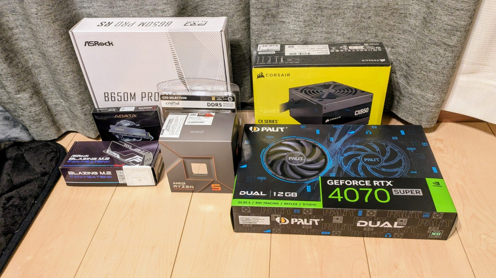

+++
title = "Ryzen 5 7600 and RTX 4070 Super PC Build: Parts, Price, and Why I Chose Them"
slug = "dev-pc-build-ryzen7600-rtx4070s"
date = 2026-03-05T00:00:00+09:00
draft = false
description = "A practical PC build using Ryzen 5 7600 and RTX 4070 Super for development, local AI experiments, and light gaming, with full parts list, total cost, and build rationale."
image = "購入パーツ一式.jpg"
tags = ["pc-build", "Ryzen 5 7600", "RTX 4070 Super", "Ubuntu", "dev-environment"]
categories = ["dev-environment"]
+++

This is a slightly older build that I bought during the Black Friday sale in November 2024.  
It is no longer the newest setup, but I am still very satisfied with it as a machine that balances software development and local AI experiments, so I wanted to document it.

## Main Use Cases

- Everyday work
- Local AI experiments
- Games that are not too demanding

## Why I Replaced My Previous PC

My previous GPU was a `GTX 760`, which was not really usable for CUDA, so AI-related development was difficult.  
I replaced the whole setup to get a machine where I could actually try AI workloads locally.

## Parts List

| Part | Model | Price | Store |
| --- | --- | ---: | --- |
| CPU + motherboard + RAM bundle | Ryzen 5 7600 / B650M Pro RS / DDR5 32GB | ¥49,800 | Sofmap |
| GPU | RTX 4070 Super | ¥93,500 | Dospara |
| SSD | M.2 500GB | ¥5,590 | Tsukumo |
| Case | CX200 RGB elite | ¥6,380 | PC Koubou |
| PSU | 650W bronze | ¥7,645 | Joshin |

**Total: ¥162,915 (tax included)**

All parts were bought online.

## Why I Chose This Configuration

### Ryzen 5 7600

It has excellent cost-performance and strong single-core performance.  
I picked it because I care a lot about day-to-day responsiveness during development, such as editor usage, builds, and general desktop work.

### RTX 4070 Super

For AI workloads, I prioritized GPU capability and VRAM.  
When you want to experiment locally, both raw GPU performance and VRAM capacity matter, so this was the main place where I concentrated the budget.

### 32GB RAM

For development work, 16GB becomes limiting pretty quickly.  
I chose 32GB because I expected to run Docker, an IDE, a browser, and databases at the same time.  
The price was also fairly reasonable at the time.

### Ubuntu

The OS is Ubuntu, so there was no licensing cost.  
That let me put more of the budget into actual performance parts such as the GPU and memory.

## Case Size and Why I Went With microATX

My previous PC used a full ATX case, and it had become annoyingly large.  
This time I switched to microATX to save space.

The case, `CX200 RGB elite`, matched its early reputation in that it has a few quirks and is not especially easy to build in.  
Internal space is fairly tight, so cable routing can feel cramped.  
That said, once the build is finished it looks good, and overall I am happy with it.

## One Note About Adding Wi-Fi Later

If you plan to add an M.2 Wi-Fi module later, be aware that the antenna cable run from the motherboard to the rear slot area is quite tight.  
Because space inside the case is limited, it is worth checking cable routing in advance.

## PSU and Cosmetic Trade-Offs

My PSU policy here was simple: if it works reliably, that is enough.  
I prioritized cost and skipped a more expensive modular power supply.

Since the case is white, I originally wanted a white GPU as well.  
But paying tens of thousands of yen more just for the color did not make sense to me, so I gave that up.  
I prioritized performance per yen over appearance.

## Storage Strategy

I reused my existing HDDs and SSDs.  
The only new storage purchase was the M.2 drive for the OS.  
That kept the total cost down while still giving me enough speed where it mattered.

## Summary

This build was based on a simple rule: spend money only where it actually matters.

- CPU: value for money
- GPU: prioritized for AI workloads
- RAM: enough for practical development work
- Savings from Ubuntu and reused storage

As a result, it turned into a very satisfying roughly 170,000 yen class machine that can handle both development work and local AI experiments in a realistic way.

## Related Posts

- [Why I Built an Ansys Version Selector Tool | Reducing the Risk of Opening Old Simulation Files in the Wrong Version](/en/blog/ansys-version-selector/)
- [Python MP3 Volume Normalizer with ffmpeg: LUFS Auto Normalization Guide](/en/blog/mp3-normalizer-devlog/)
