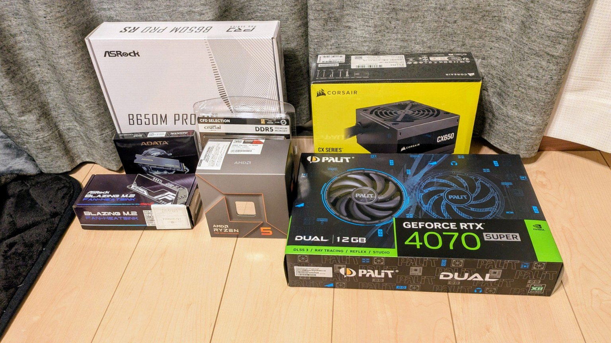

+++
title = 'Ryzen 7600 + RTX 4070 Super 自作PC構成と購入価格（16.3万円）'
slug = 'dev-pc-build-ryzen7600-rtx4070s'
date = 2026-03-05T00:00:00+09:00
draft = false
description = '2024年11月ブラックフライデーで購入。Ryzen 5 7600とRTX 4070 Superで組んだ開発兼AI用途PCの構成と選定理由'
image = '購入パーツ一式.jpg'
tags = ['自作PC','Ryzen','RTX4070Super','Ubuntu','開発環境']
categories = ['PC構成']
+++

2024年11月のブラックフライデーセールで購入した、少し前の構成です。  
最新ではないものの、開発・ローカルAI実験の両立という観点では、いまでも満足度の高い環境なので紹介します。

## 主な用途

- 日常作業
- ローカルAI実験
- 重すぎないゲーム

## 買い替えた理由

前のGPUは `GTX 760` で、CUDAが満足に動かずAI開発が難しかった。  
ローカルでAIを試せる環境を作るために、今回の構成へ買い替えた。

## 構成

| パーツ | 型番 | 価格 | 購入 |
| --- | --- | ---: | --- |
| CPU+MB+RAM セット | Ryzen 5 7600 / B650M Pro RS / DDR5 32GB | ¥49,800 | ソフマップ |
| GPU | RTX 4070 Super | ¥93,500 | ドスパラ |
| SSD | M.2 500GB | ¥5,590 | ツクモ |
| ケース | CX200 RGB elite | ¥6,380 | PC工房 |
| 電源 | 650W bronze | ¥7,645 | Joshin |

**合計: ¥162,915(税込み)**

※ すべてネット通販で購入。

## なぜこの構成か

### Ryzen 5 7600
コスパが良く、シングル性能が高い。  
開発中の体感（エディタ操作、ビルド、普段使い）を重視して採用。

### RTX 4070 Super
AI用途を見据えてVRAM容量を優先。  
ローカルで触るにはGPU性能とVRAMが効くので、ここに予算を寄せた。

### メモリ32GB
開発用途では16GBだと不足しやすい。  
Docker・IDE・ブラウザ・DB同時利用を考えて32GBを選択。  
当時価格が安かったのも後押し。

### Ubuntu運用
OSはUbuntuなので無料。  
OS分のコストを、GPUやメモリなど実効性能に回した。

## ケースとサイズ感（microATXにした理由）

前のPCはATXで、設置時にさすがに邪魔だった。  
今回はmicroATXで作成して省スペース化。

ケース（CX200 RGB elite）は[前評判](https://zack-it.com/antec-cx200m-rgb-elite-wh-review/2/)どおり少しクセがあり、組み立てやすさは高くない。  
内部の余裕も少なめで配線はやや窮屈。  
ただし組み立て後の見栄えは良く、最終的な満足度は高い。

## Wi-Fi増設時の注意

M.2 Wi-Fiを後付けする場合、  
マザーボードから伸ばすアンテナ線と背面スロット側までの距離が長く、かなりきつきつ。  
ケース内スペースが限られるので、取り回しは先に確認した方がよい。

## 電源と見た目の割り切り

電源は「動けばよい」方針で、コスト優先。  
高いプラグイン（フルモジュラー）電源は見送った。

ケースが白なので本当はGPUも白で揃えたかったが、  
色のためだけに数万円上がるのは割に合わないと判断して断念。  
見た目より性能単価を優先した。

## ストレージ方針

HDDとSSDは既存資産を使い回し。  
追加購入したのはOS用のM.2のみ。  
必要十分な速度を確保しつつ、総額を抑えられた。

## まとめ

この構成は「使うところにだけ金をかける」方針で組んだ1台。  
- CPUはコスパ重視
- GPUはAI用途重視
- メモリは実用容量を確保
- OS無料・既存ストレージ流用で節約

結果として、開発もAIも現実的に回せる、満足度の高い17万円クラスのPCになった。
