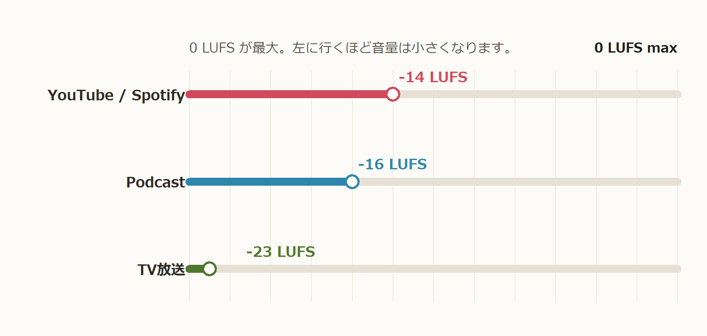

+++
title = '【コマンド例あり】ffmpeg loudnormの使い方｜LUFS正規化と2pass設定を解説'
date = 2026-03-08T00:00:00+09:00
draft = false
description = 'ffmpeg の loudnorm フィルタで LUFS 正規化する方法を解説。1pass/2pass、True Peak、LRA、再エンコード、メタデータ保持まで実例付きでまとめました。'
tags = ['ffmpeg', 'loudnorm', 'LUFS', 'MP3']
categories = ['プロジェクト']
+++

## この記事でやること

`ffmpeg` の `loudnorm` フィルタを使って、音声ファイルの音量を LUFS ベースで揃える方法を整理します。

単に「コマンドを貼って終わり」ではなく、次の点までまとめて押さえます。

- `LUFS` とは
- `ffmpeg` とは
- `ラウドネス正規化` の主要パラメータ
- 正規化後に必要な再エンコード
- MP3 のメタデータやアートワークを落としにくくする方法

関連する実装寄りの記事として、Python から ffmpeg を呼び出して音声ファイルをまとめて正規化する話は [音楽の音量を自動調整するツールをPythonで作る LUFS正規化開発ログ](/blog/mp3-lufs-normalizer-python/) にまとめています。

## 目次

- [対象読者](#対象読者)
- [前提](#前提)
- [`LUFS` とは](#lufs-とは)
- [ffmpegとは](#ffmpegとは)
- [`loudnormフィルタ` で使う主要パラメータ](#loudnormフィルタ-で使う主要パラメータ)
- [1pass と 2pass の違い](#1pass-と-2pass-の違い)
- [loudnorm を使うとイントロが大きくなる理由](#loudnorm-を使うとイントロが大きくなる理由)
- [正規化後は再エンコードが必要](#正規化後は再エンコードが必要)
- [ストリームマッピングでタグとアートワークを残す](#ストリームマッピングでタグとアートワークを残す)
- [フィルタチェーンの考え方](#フィルタチェーンの考え方)
- [測定用途の ffmpeg 実行方法](#測定用途の-ffmpeg-実行方法)
- [実用テンプレート](#実用テンプレート)
- [まとめ](#まとめ)

## 対象読者

- `ffmpeg` で音量を揃えたいが、`loudnorm` の引数の意味が曖昧な人
- MP3 のアートワークやタグを極力残したまま正規化したい人
- 上記処理の流れを理解したい人

## 前提

- `ffmpeg` 6.x 系を利用できること(ffmpeg の導入は [この Qiita 記事](https://qiita.com/Tadataka_Takahashi/items/9dcb0cf308db6f5dc31b) を参考)
- 主な対象は MP3 だが、考え方自体は AAC / WAV / FLAC などでもほぼ同じ
- 本記事のコマンド例は PowerShell や bash でも読み替えやすい形で書く

## `LUFS` とは

`LUFS(Loudness units relative to full scale)` は、ラウドネス(人が感じる音の大きさ)の単位の一つで、人間の聴感と一致させることを目的とした指標です。最大値(デジタル音声の振幅の最大値)を0と定義し、通常は負の値をとる(重力による位置エネルギーと同じ感じ)



## ffmpegとは

- 公式サイト: <https://ffmpeg.org/>
- GitHub: <https://github.com/FFmpeg/FFmpeg>

ffmpeg は、動画や音声を処理するためのオープンソースのマルチメディアツールです。
コマンドラインから実行でき、形式変換・編集・解析などさまざまなメディア処理を行えます。

Python から利用したい場合は、ffmpeg をインストールしたうえで  
`ffmpeg-python` などのラッパーライブラリを利用することもできます。

本記事では、特に **音声ファイル（主に MP3）のラウドネス正規化** に焦点を当てて解説します。

普段使いなら、まずは次の形を基準にして、用途に合わせてカスタムすると分かりやすいです。(1passの場合)

```bash
ffmpeg -i input.mp3 \
  -map 0 -map_metadata 0 -c:v copy \
  -af "loudnorm=I=-14:TP=-1.5:LRA=11" \
  -c:a libmp3lame -q:a 2 \
  output.mp3
```

このコマンドの引数について解説します。

`-i input.mp3`  
入力ファイル。

`-map 0`  
音声ファイルに含まれる すべてのストリーム（音声・アートワークなど） を出力に引き継ぐ指定です。  
これを指定しない場合、アートワーク情報が失われます。

音声だけ(デフォルト)  
`-map 0:a`

`-map_metadata 0(デフォルト)`  
音声ファイルのメタデータ（ID3タグなど）をコピーします。  
曲名、アーティスト、アルバム情報などを保持するために指定します。

(入力ファイルが2つあるときに)  
`-map_metadata 1` で2つ目のファイルのメタデータをコピー

メタデータを削除  
`-map_metadata -1`

`-c:v copy`  
MP3 のアルバムアートは video ストリーム（attached_pic）として扱われます。  
`-c:v copy` を指定すると、このアートワークを再エンコードせずそのままコピーできます。

`-af "loudnorm=I=-14:TP=-1.5:LRA=11"`  
音声フィルタを指定します。ここでは loudnorm フィルタを使い、ラウドネス正規化を行います。  
各パラメータの意味は後述。

`-c:a libmp3lame`  
音声コーデックを指定します。  
MP3 のエンコードには libmp3lame が一般的に使われます。

`-q:a 2`  
MP3 の VBR（可変ビットレート）品質指定です。  
2 は高品質設定で、平均ビットレートは およそ 190kbps 前後になります。

`output.mp3`  
出力ファイル名です。

ただし、より正確に狙ったラウドネスへ合わせたいなら `2pass` を使います。ここから先で順番に見ていきます。

## `loudnormフィルタ` で使う主要パラメータ

`loudnorm` でまず覚えるべき項目は次のとおりです。

| パラメータ | 意味 |
| --- | --- |
| `I` | 目標 LUFS（Integrated Loudness） |
| `TP` | True Peak の上限 |
| `LRA` | Loudness Range の目標値 |
| `linear` | 線形補正を使うかどうか |
| `measured_*` | `2pass` 用の測定結果 |

記事全体でも、この 5 系統を中心に見ていきます。

### `I(目標 LUFS（Integrated Loudness）)`

つまり、「最終的にどの LUFS へ寄せたいか」を決める中心パラメータです。

たとえば次のように使います。0が最大値で値が小さい方が小さい音になります。

- `I=-14`: Youtube,Spotify
- `I=-16`: Podcast
- `I=-23`: TVなど

ラウドネス正規化ではまず `I` を決める、と考えると整理しやすいです。

### `TP(True Peakの上限)`
サンプル間ピークまで含めた実質的なピーク値をどこまで許容するかを決めます。

波形上ではクリップしていなくても、再生や変換の過程で実効ピークが上振れして0 dBFSを超えることがあります。その場合にノイズが発生してしまいます。これを防ぐため、ラウドネス正規化では `TP` を少し余裕を持って制限するのが一般的です。

よくある設定例は次のとおりです。

- `TP=-1.0`
- `TP=-1.5`
- `TP=-2.0`

迷ったら `-1.5 dBTP` 前後から始めると安全です。

### `LRA`

`LRA` は `Loudness Range` で、曲の中の音量変動の広さを示します。

値が大きいほど、静かな部分と大きい部分の差が大きいということです。クラシックや映画音声のようにダイナミクスが大きい素材では高くなりやすく、ポップスでは比較的小さくなります。

`loudnorm` の `LRA` は、音量差をどの程度の範囲へ収めたいかの目安です。まずは `I` と `TP` を主軸に考え、必要なら `LRA` を調整する順が分かりやすいです。

迷ったら `LRA=11` 前後で十分です。

| ジャンル / 用途 | LRAの目安 |
| --- | --- |
| ポップス / ロック | 6〜10 |
| EDM / ダンス | 4〜8 |
| 一般的な音楽 | 6〜12 |
| クラシック / 映画音声 | 12〜20 |


### `linear`

`linear=true` は、可能なら線形補正で処理する指定です。Trueだと音声全体を同じ倍率で上げ下げします。

| 処理    | 結果           |
| ----- | ------------ |
| +3 dB | 全体が同じだけ大きくなる |
| -3 dB | 全体が同じだけ小さくなる |

つまり、曲の抑揚は変わらない

`2pass` で測定結果を渡すときによく使われます。逆に`1pass`では線形補正が効ききらない可能性があります。
`1pass` `2pass`は後述

普段は `I` / `TP` / `LRA` を先に理解しておけば十分で、`linear` は `2pass` の精度を安定させる補助設定と考えると分かりやすいです。

### `measured_*`

`measured_*` は、1 回目で得た測定値を 2 回目に引き渡すためのパラメータ群です。実際には次の対応になります。

- `measured_I` ← `input_i`
- `measured_TP` ← `input_tp`
- `measured_LRA` ← `input_lra`
- `measured_thresh` ← `input_thresh`
- `offset` ← `target_offset`

要するに、`2pass loudnorm` は「1 回目の解析結果を、そのまま 2 回目の補正条件へ渡す」流れです。

## 1pass と 2pass の違い

### 1pass

1 回の ffmpeg 実行で、そのまま解析と補正を行う方法です。

```bash
ffmpeg -i input.mp3 \
  -af "loudnorm=I=-14:TP=-1.5:LRA=11" \
  -c:a libmp3lame -q:a 2 \
  output.mp3
```

利点はシンプルで速いことです。バッチ処理や手早い試行には向いています。

ただし、厳密に狙った値へ合わせたいケースでは `2pass` よりぶれやすくなります。

### 2pass

1 回目で測定し、2 回目でその測定値を渡して本番変換する方法です。

1 回目は、出力を捨てながら JSON を取得します。

```bash
ffmpeg -i input.mp3 \
  -af "loudnorm=I=-14:TP=-1.5:LRA=11:print_format=json" \
  -f null -
```

この結果から以下のような値を拾います。

- `input_i`
- `input_tp`
- `input_lra`
- `input_thresh`
- `target_offset`

2 回目で `measured_*` として渡します。

```bash
ffmpeg -i input.mp3 \
  -map 0 -map_metadata 0 -c:v copy \
  -af "loudnorm=I=-14:TP=-1.5:LRA=11:linear=true:measured_I=-18.3:measured_TP=-0.7:measured_LRA=9.5:measured_thresh=-29.2:offset=-0.1" \
  -c:a libmp3lame -q:a 2 \
  output.mp3
```

`2pass` の利点は、目標ラウドネスへより安定して寄せやすいことです。ツール化するなら、測定フェーズと本番フェーズを分けて設計しておくと扱いやすくなります。

## loudnorm を使うとイントロが大きくなる理由

`loudnorm` は、曲全体の `Integrated Loudness` を見て「最終的に目標 LUFS へ寄せる」フィルタです。つまり、静かなイントロだけを個別に判定しているのではなく、曲全体を 1 つのまとまりとして補正量を決めます。

そのため、次のような曲ではイントロが想定以上に持ち上がって聞こえることがあります。

- イントロだけ極端に静かで、途中から急に音圧が上がる曲
- A メロとサビの差が大きい曲
- もともとダイナミクスが広い音源

特に `linear=true` の補正では、全体をほぼ同じ倍率で上げ下げする考え方になるため、サビに合わせて少し持ち上げたいだけでも、静かなイントロまでまとめて大きくなります。

また、`TP` はピークの上限を抑えるための値であり、イントロの体感音量が上がること自体は防ぎません。`LRA` もダイナミクスの目安にはなりますが、「静かな導入だけは上げすぎない」という専用の制御ではありません。

つまり、イントロが大きくなる主な理由は次の 2 つです。

- `loudnorm` が曲全体の平均的なラウドネスを基準に補正すること
- 静かな部分と大きい部分の差が大きい素材では、静かな部分も一緒に持ち上がりやすいこと

対策としては、次の方向が考えられます。

- `1pass` ではなく `2pass` でより安定して補正する
- 目標 LUFS を少し下げる
- 素材によっては `loudnorm` だけでなく、前段の編集や別のダイナミクス処理も検討する

## 正規化後は再エンコードが必要

`loudnorm` のような音声フィルタを使う場合、音声はデコードして処理し、改めてエンコードし直す必要があります。そのため、音声に対してはストリームコピーでは済みません。

ここで関係する主なオプションが次の 3 つです。

| 項目 | 理由 |
| --- | --- |
| 再エンコード | フィルタ使用時は必須 |
| VBR / CBR | 音質とサイズのバランスに関わる |
| ビットレート | 低すぎると劣化要因になる |

### 代表的な指定

```bash
-c:a libmp3lame -q:a 2
```

これは MP3 を VBR で比較的高音質に再エンコードする例です。

### よく使う指定の考え方

- `-c:a libmp3lame`: MP3 へ再エンコードする
- `-q:a 2`: VBR 品質指定。低いほど高音質寄り
- `-b:a 192k`: CBR や ABR 寄りでビットレートを明示したいときに使う

音質とサイズのバランスを取りたいなら、まずは `-q:a 2` か `-q:a 3` あたりから始めるのが実用的です。

## ストリームマッピングでタグとアートワークを残す

MP3 には音声以外にも、次の情報が入っていることがあります。

- audio
- metadata
- artwork

ここで雑に変換すると、「音は出るがジャケット画像が消えた」「タグが一部落ちた」という事故が起きやすくなります。

よく使うのは次の指定です。

```bash
-map 0 -map_metadata 0 -c:v copy
```

### それぞれの意味

- `-map 0`: 入力 0 の全ストリームを対象にする
- `-map_metadata 0`: メタデータを入力 0 からコピーする
- `-c:v copy`: 画像ストリームがあれば再エンコードせずコピーする

### アートワークが消える理由

MP3 の埋め込みジャケットは、実質的には画像ストリームとして扱われることがあります。音声だけを明示して出力すると、その画像ストリームがマッピング対象から外れて落ちます。

また、ID3 タグだけコピーしても、埋め込み画像の保持まで必ず保証されるわけではありません。MP3 の再エンコード時にアートワークを残したいなら、`-map 0` と `-c:v copy` をまず確認するのが基本です。

## フィルタチェーンの考え方

音声処理では `-af` を使ってフィルタを数珠つなぎにできます。

```bash
ffmpeg -i input.mp3 \
  -af "afftdn,agate,loudnorm=I=-14:TP=-1.5:LRA=11" \
  -c:a libmp3lame -q:a 2 \
  output.mp3
```

よく見かけるフィルタの役割は次のとおりです。

| フィルタ | 用途 |
| --- | --- |
| `loudnorm` | ラウドネス正規化 |
| `afftdn` | ノイズ除去 |
| `agate` | ノイズゲート |

ただし、本記事で中心に据えるべきなのは `loudnorm` です。ノイズ除去やゲートは素材次第で効きすぎることもあるため、まずは単独で正規化を安定させ、その後に前処理を足すほうが安全です。

## 測定用途の ffmpeg 実行方法

ツールを作るときに特に重要なのが、「まず測定だけ行って JSON を取る」使い方です。

主に使うのは次の 2 点です。

- `-f null`
- `print_format=json`

### 測定専用コマンド

```bash
ffmpeg -hide_banner -i input.mp3 \
  -af "loudnorm=I=-14:TP=-1.5:LRA=11:print_format=json" \
  -f null -
```

ポイントは、実ファイルを書かずに解析だけ進められることです。`stdout` / `stderr` の取り回しは実装言語次第ですが、CLI ツールや GUI アプリから呼ぶ場合はこの JSON を拾って 2pass の入力値へ変換します。

### ツール実装で押さえる点

- 1 回目は測定専用で出力ファイルを作らない
- JSON から `input_i` などの値を抜く
- 2 回目の `loudnorm` に `measured_*` と `offset` を渡す
- 本番変換では `-map 0 -map_metadata 0 -c:v copy` を併用してメタデータ保持を意識する

## 実用テンプレート

### まず試す 1pass

```bash
ffmpeg -i input.mp3 \
  -map 0 -map_metadata 0 -c:v copy \
  -af "loudnorm=I=-14:TP=-1.5:LRA=11" \
  -c:a libmp3lame -q:a 2 \
  output.mp3
```

### きっちり揃えたい 2pass

1 回目:

```bash
ffmpeg -i input.mp3 \
  -af "loudnorm=I=-14:TP=-1.5:LRA=11:print_format=json" \
  -f null -
```

2 回目:

```bash
ffmpeg -i input.mp3 \
  -map 0 -map_metadata 0 -c:v copy \
  -af "loudnorm=I=-14:TP=-1.5:LRA=11:linear=true:measured_I=...:measured_TP=...:measured_LRA=...:measured_thresh=...:offset=..." \
  -c:a libmp3lame -q:a 2 \
  output.mp3
```

## まとめ

- `loudnorm` の中心は `I`, `TP`, `LRA`, `linear`, `measured_*`
- 普段使いなら `1pass`、精度重視なら `2pass`
- フィルタを使う以上、音声は再エンコードが必要
- MP3 のタグやアートワークを残したいなら `-map 0 -map_metadata 0 -c:v copy` を意識する
- ツール化するなら `print_format=json` と `-f null -` を使った測定フェーズが重要

Python からまとめて処理したい場合や、GUI / CLI で自動化したい場合は、関連する実装メモを [音楽の音量を自動調整するツールをPythonで作る LUFS正規化開発ログ](/blog/mp3-lufs-normalizer-python/) に整理しています。

## 関連記事

- [Pythonとffmpegで音量自動調整ツールを作る｜LUFS正規化の開発ログ](/blog/mp3-lufs-normalizer-python/)
- [Ryzen 7600＋RTX 4070 Superの自作PC構成例｜購入価格16.3万円の実例紹介](/blog/dev-pc-build-ryzen7600-rtx4070s/)
