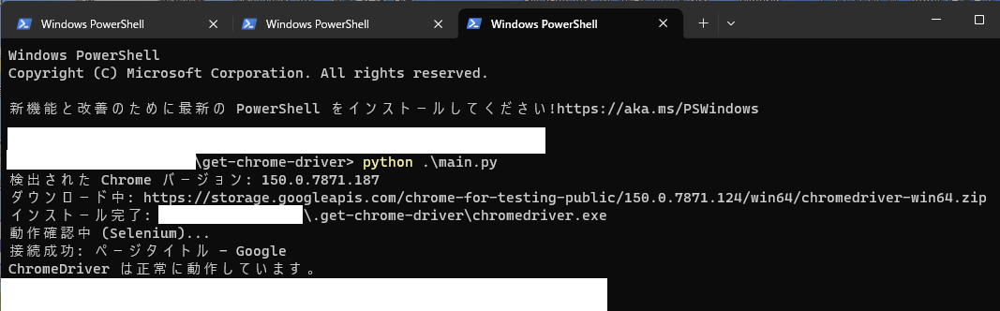
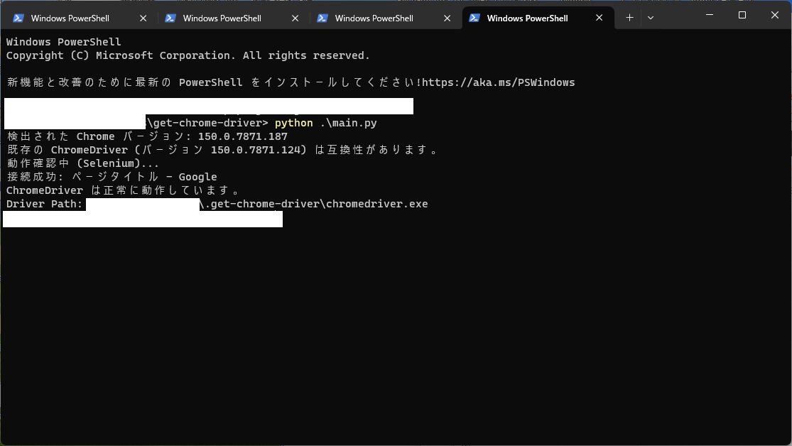

+++
title = "ChromeDriverとChromeのバージョン不一致エラーを自動で解決するプログラム"
date = 2026-03-04T00:00:00+09:00
lastmod = 2026-07-31T00:00:00+09:00
draft = false
description = "Chromeの自動更新でSeleniumが止まる問題を、Chrome for Testing APIからドライバを自動取得するPythonツールで解決する。"
tags = ["Python", "Selenium", "ChromeDriver", "自動化", "スクレイピング"]
categories = ["プロジェクト"]
+++

## 目次

- [解決したい課題：Chromeが自動更新されるとジョブが実行されない](#解決したい課題chromeが自動更新されるとジョブが実行されない)
- [実装：ドライバ取得の自動化(コードの簡単な解説)](#実装ドライバ取得の自動化コードの簡単な解説)
  - [1. インストール済みChromeのバージョンを検出する](#1-インストール済みchromeのバージョンを検出する)
  - [2. Chrome for Testing APIからダウンロードURLを探す](#2-chrome-for-testing-apiからダウンロードurlを探す)
  - [3. 保存済みドライバを再利用する](#3-保存済みドライバを再利用する)
  - [4. ZIPから実行ファイルだけを取り出す](#4-zipから実行ファイルだけを取り出す)
  - [5. 実際に起動できるか検証する](#5-実際に起動できるか検証する)
- [使い方](#使い方)
  - [0. 用意するもの](#0-用意するもの)
  - [1. ダウンロードする](#1-ダウンロードする)
  - [2. 仮想環境を作る](#2-仮想環境を作る)
  - [3. 必要なライブラリを入れる](#3-必要なライブラリを入れる)
  - [4. 自分のスクリプトから呼び出す](#4-自分のスクリプトから呼び出す)
- [さいごに](#さいごに)


## 解決したい課題：Chromeが自動更新されるとジョブが実行されない
Seleniumが起動しないとき、原因の99%はChromeとChromeDriverのバージョン不一致だ。  
Chromeは勝手に自動更新される。しかもこの頻度が意外と多い。  
ChromeDriverは更新されない。結果、前日まで動いていたプログラムが翌朝には次のエラーで止まっている。

```text
selenium.common.exceptions.SessionNotCreatedException:
Message: session not created:
This version of ChromeDriver only supports Chrome version 149
Current browser version is 150.0.xxxx.xx
```

手作業で直すなら、Chromeのバージョンを調べ、対応するChromeDriverを[Chrome for Testing](https://googlechromelabs.github.io/chrome-for-testing/)からDLして既存のファイルを差し替える。
メジャーバージョンが更新されるときのみとはいえ非常に面倒である。

また、Chromeの自動更新を強制的に止めることでこの課題に対処している人もいる。  
([Google Chromeのバージョン自動更新を停止する方法](https://funcref.com/chrome-auto-update-disable-windows/))

そして現在のSelenium(4.6.0以降)ならインストールされているChromeのバージョンに合うドライバを自動でダウンロードしてくれる。 (ツールを作ってからこの機能を知りました。いうといてや！そんなんできるんやったら。)  
まず次を試してほしい。   
参考 ([Selenium 4.6はドライバ、4.11ではブラウザすら準備してくれる](https://gammasoft.jp/support/selenium-with-batteries-included/))

```python
from selenium import webdriver

driver = webdriver.Chrome()  # ドライバのパスを指定しない
driver.get("https://mitz17.com")
time.sleep(5)
driver.quit()
```

これで動くなら、この記事は読まなくていい。

一方、次のような場合はドライバを自前で管理する必要がある。

- Seleniumを起動する前に、ChromeとChromeDriverのバージョンを明示的に確認したい
- ドライバの保存場所を固定したい
- 古いSeleniumを使わざるを得ない

そんな変わった人のためにドライバーを自動取得するツールを作成しました。
対応OS: Windows , Ubuntu , macOS

全文はGitHubにupしています : [mitz17/get-chrome-driver](https://github.com/mitz17/get-chrome-driver)

※この記事の内容は2026年7月時点の情報です。

## 実装：ドライバ取得の自動化(コードの簡単な解説)

処理は「Chromeの検出 → APIへの照会 → キャッシュ確認 → 展開 → 起動確認」の5段階になる。

### 1. インストール済みChromeのバージョンを検出する

Windowsではレジストリ(`HKCU:\Software\Google\Chrome\BLBeacon`)と`chrome.exe`の製品バージョンを見る。LinuxとmacOSでは候補コマンドを順番に実行する。

```python
commands = [
    "google-chrome",
    "google-chrome-stable",
    "chromium",
    "chromium-browser",
]

for command in commands:
    try:
        output = subprocess.check_output([command, "--version"]).decode().strip()
        match = re.search(r"[\d.]+", output)
        if match:
            version = match.group(0)
            break
    except (subprocess.CalledProcessError, FileNotFoundError):
        continue
```


### 2. Chrome for Testing APIからダウンロードURLを探す

`known-good-versions-with-downloads.json`を取得し、Chromeと同じメジャーバージョンのエントリを末尾から探す。JSON内でOSとCPUは`linux64`、`mac-arm64`、`mac-x64`、`win32`、`win64`の5種類で識別されるため、`platform.system()`と`platform.machine()`から該当する文字列を組み立てて照合する。

```python
def _extract_from_versions(entries, major_version, platform_name):
    for entry in reversed(entries):
        version = entry.get("version", "")
        if not version.startswith(f"{major_version}."):
            continue

        downloads = entry.get("downloads", {}).get("chromedriver", [])
        for download in downloads:
            if download.get("platform") == platform_name:
                return version, download.get("url")

    return None, None
```

### 3. 保存済みドライバを再利用する

保存済みドライバのメジャーバージョンがChromeと一致していれば、そのまま使う。

```python
existing_version = self._get_installed_driver_version()
target_major = version.split(".")[0]

if existing_version:
    existing_major = existing_version.split(".")[0]
    if existing_major == target_major and self.driver_path.exists():
        print(f"Existing ChromeDriver version {existing_version} is compatible.")
        return str(self.driver_path)
```
保存先は`~/.get-chrome-driver/`としている。

### 4. ZIPから実行ファイルだけを取り出す

ダウンロードしたZIPを`extractall()`で丸ごと展開すると、アーカイブ内のパスが`../`や絶対パスを含んでいた場合に意図しない場所へ書き込まれる。いわゆるZip Slipだ。
そこで各エントリのパスを検査し、`chromedriver`(または`chromedriver.exe`)という名前のファイル1つだけをストリームでコピーする。

```python
with zipfile.ZipFile(io.BytesIO(response.content)) as archive:
    driver_member = None

    for member in archive.infolist():
        member_path = os.path.normpath(member.filename)
        if os.path.isabs(member_path) or member_path.startswith(".."):
            continue
        if os.path.basename(member_path) == self.driver_name:
            driver_member = member
            break

    with archive.open(driver_member) as source, open(self.driver_path, "wb") as target:
        shutil.copyfileobj(source, target)
```

LinuxとmacOSでは実行権限も付与する。

```python
if os.name != "nt":
    self.driver_path.chmod(0o755)
```

OSごとのデフォルト保存先は以下のとおりである

| OS           | ファイル名              | 保存先                                    |
| ------------ | ------------------ | -------------------------------------- |
| Windows      | `chromedriver.exe` | `C:\Users\<ユーザー名>\.get-chrome-driver\` |
| Ubuntu・macOS | `chromedriver`     | `/home/<ユーザー名>/.get-chrome-driver/`    |

 

### 5. 実際に起動できるか検証する

最後にヘッドレスChromeを起動し、セッションが作れることを確認する。

```python
options = Options()
options.add_argument("--headless")
options.add_argument("--no-sandbox")
options.add_argument("--disable-dev-shm-usage")

service = Service(executable_path=driver_path)
driver = webdriver.Chrome(service=service, options=options)

try:
    driver.get("https://google.com")
    print(driver.title)
finally:
    driver.quit()
```

## 使い方

### 0. 用意するもの
 
- Python 3.8以上
- Google Chrome
- git

### 1. ダウンロードする
 
```bash
git clone https://github.com/mitz17/get-chrome-driver.git
cd get-chrome-driver
```
 
`cd`まで実行して、以降はこのフォルダの中で作業する。
 
### 2. 仮想環境を作る
 
仮想環境(venv)は、このツール用のライブラリをPC全体とは別の場所に隔離しておく仕組みだ。作らなくても動くが、他のPythonプロジェクトとライブラリのバージョンが衝突しなくなるので作っておくとよい。
 
```bash
python -m venv .venv
```
 
作成したら「有効化」する。OSごとにコマンドが違う。
 
```powershell
# Windows(PowerShell)
.\.venv\Scripts\Activate.ps1
```
```bash
# macOS・Linux
source .venv/bin/activate
```
 
成功すると、プロンプトの先頭に`(.venv)`が付く。これが目印だ。ターミナルを閉じると無効になるので、次回作業するときはもう一度有効化する。
  
### 3. 必要なライブラリを入れる
 
```bash
python -m pip install -r requirements.txt
```
 
`requirements.txt`に書かれたライブラリ(Seleniumなど)がまとめて入る。

### 4. 自分のスクリプトから呼び出す
 
ここからが本題だ。`install()`を呼ぶと、検出・取得・キャッシュ・起動確認までを済ませてChromeDriverのパスを返す。それを`Service`へ渡す。
 
```python
from get_chrome_driver.core import GetChromeDriver
from selenium import webdriver
from selenium.webdriver.chrome.service import Service
 
# ChromeDriverを用意してパスを受け取る
installer = GetChromeDriver()
driver_path = installer.install()
 
service = Service(executable_path=driver_path)
driver = webdriver.Chrome(service=service)
 
try:
    driver.get("https://mitz17.com")
    print(driver.title)
    # ここに自動化したい処理を書く
finally:
    driver.quit()  # 必ず閉じる
```

初回実行時は、Chromeのバージョンに対応するChromeDriverをダウンロードして保存する。



2回目以降は、保存済みのChromeDriverが利用できるため、ダウンロードは発生しない。


 
`try`/`finally`で囲み、`finally`に`driver.quit()`を置くのが重要だ。途中でエラーが出て`quit()`が呼ばれないと、Chromeのプロセスが終了せずに残り続ける。定期実行するスクリプトでは、これが積み上がってメモリを食い潰す原因になる。
 
ChromeDriverの保存場所が固定されるため、PATHへの追加は不要だ。

## さいごに

皆様のQOSLが向上することを切に願う。
