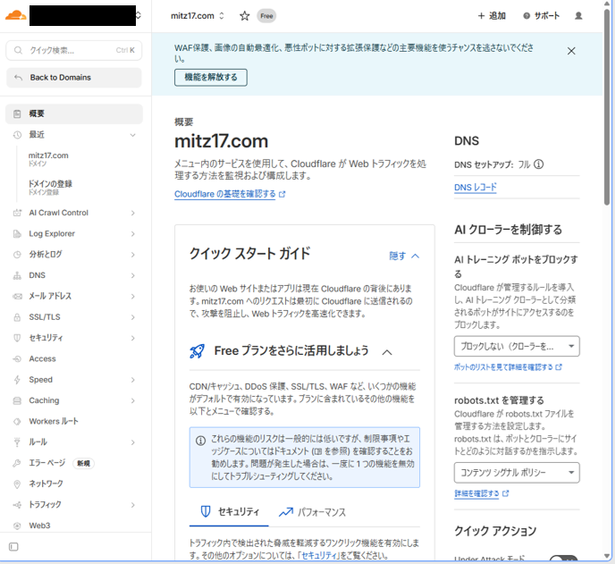
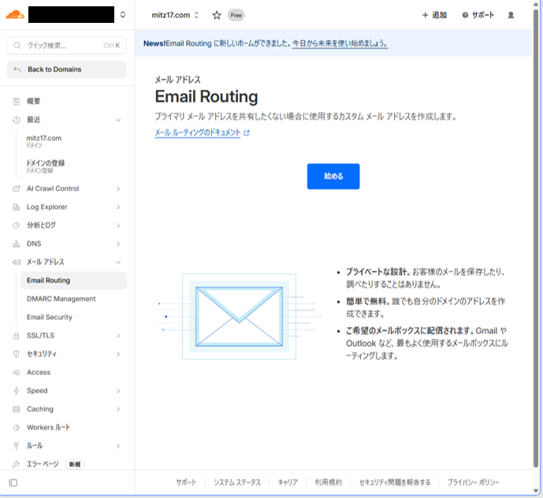
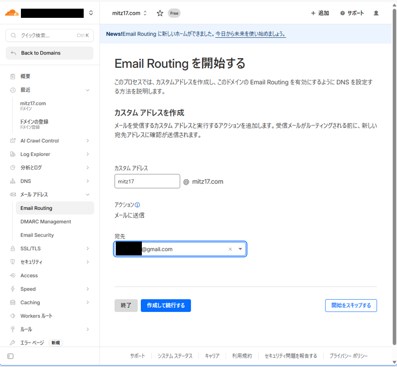
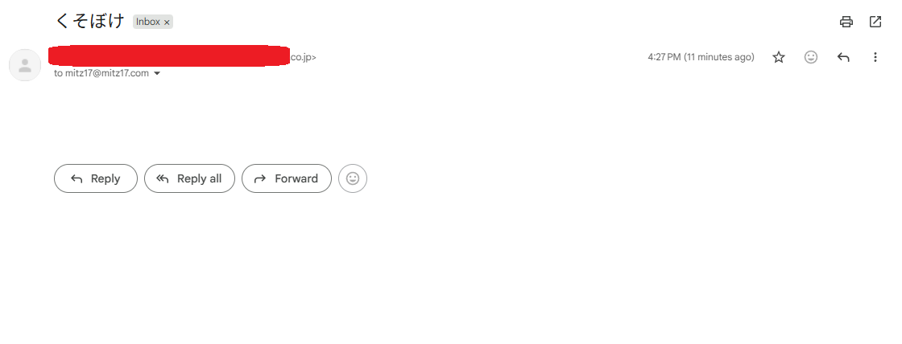

+++
title = 'Cloudflare Email Routingで独自ドメインのメールを受信する'
date = 2026-03-02T12:00:00+09:00
draft = false
description = 'Cloudflare Email Routing と Gmail を使って無料で独自ドメインのメールを受信したい'
tags = ['Cloudflare', 'メール']
categories = ['プロジェクト']
+++

## この記事でやること

独自ドメイン `mitz17.com` で メールアドレスを作り、Cloudflare Email Routing を使って Gmail へ無料で転送。サーバー構築なし、ほぼノーコードで完結した。

## 参考にした資料

- [CloudflareのEmail Routingでカスタムドメイン宛メールを受信する手順](https://note.com/yetanother_yk/n/ncdbb530e1cc5) 

## 操作1: Cloudflare でドメインの管理画面を表示

### 手順
1. Cloudflare にログイン。
2. 対象ドメイン（今回は `mitz17.com`）を選択。

## 操作2: 開始ボタンを押す

### 手順
1. 左メニューの「メールアドレス」→「Email Routing」を開く。
2. 「開始」をクリック。

## 操作3: アドレスの設定

### 手順
1. 「カスタムアドレス」に好きなメールアドレスを入力  
   （例: `mitz17@mitz17.com`）
2. 「宛先」に転送したい Gmail アドレスを入力
3. 「作成して続行」をクリック

すると Gmail に確認メールが届く。

メール内の **"Verify email address"** をクリックすれば認証完了。

だいたい数分待てば設定が反映される。

## 操作4: 受信テスト

### 手順
外部アドレスからテストメールを送る。

Gmailに届けば成功。

届かない場合は：

- MXレコードが間違っている
- まだDNSが反映されていない
- 認証が終わっていない

このあたりをチェック。

## まとめ

Cloudflare Email Routing と Gmail で自分のドメインのメールを受け取れるようになりました。

受信は簡単。

問題は「送信側」。(らしい)

SendGrid の無料プランがサ終したそうなので、  
Mailgun か AWS SES あたりを検討中。

次は送信環境を作る。
