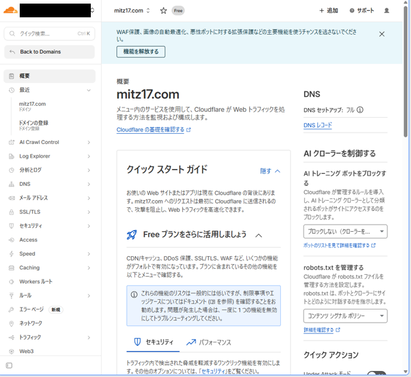
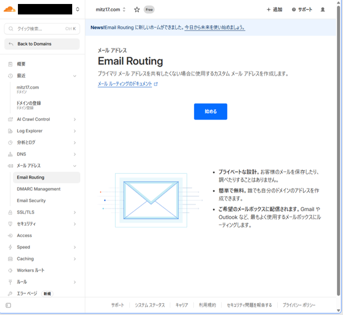
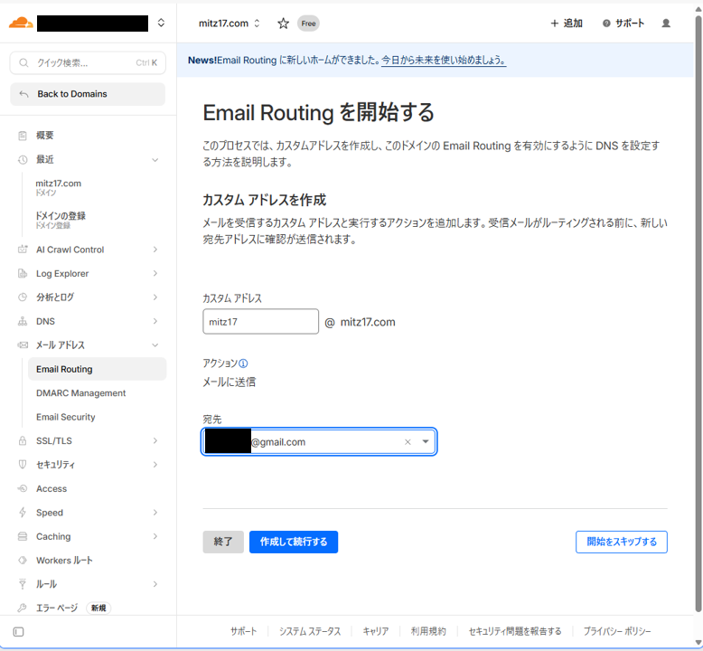
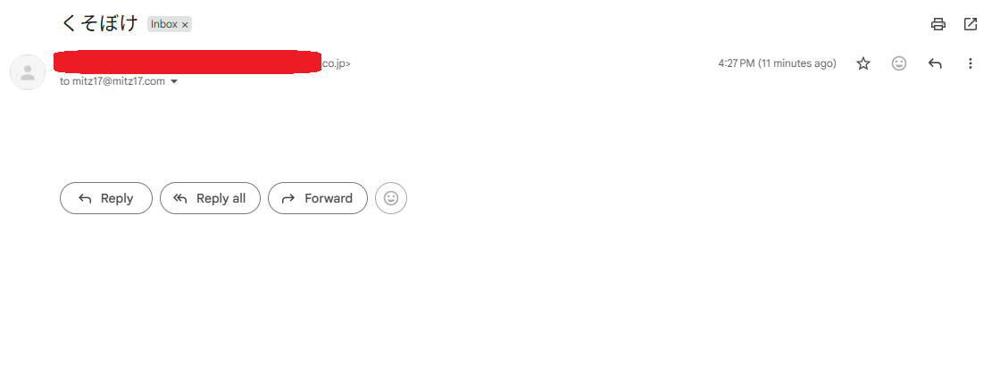

+++
title = '【初心者向け】Cloudflare Email Routingの設定方法｜独自ドメインのメールをGmailで受信する手順'
date = 2026-03-02T12:00:00+09:00
draft = false
description = 'Cloudflare Email Routing を使って、独自ドメイン宛てのメールを Gmail で無料受信する設定手順を解説。サーバー不要で、ほぼノーコードで始められます。'
tags = ['Cloudflare', 'Email Routing', '独自ドメイン', 'メール', 'Gmail']
categories = ['プロジェクト']
+++

## この記事でやること

独自ドメイン `mitz17.com` でメールアドレスを作り、Cloudflare Email Routing を使って Gmail へ無料で転送する仕組みを作りました。サーバーの構築は不要で、ほぼノーコードで完結しました。

## 参考にした資料

- [CloudflareのEmail Routingでカスタムドメイン宛メールを受信する手順](https://note.com/yetanother_yk/n/ncdbb530e1cc5)

## 操作1: Cloudflare でドメインの管理画面を表示

### 手順
1. Cloudflare にログインします。
2. 対象ドメイン（今回は `mitz17.com`）を選択します。

## 操作2: 開始ボタンを押す

### 手順
1. 左メニューの「メールアドレス」→「Email Routing」を開きます。
2. 「開始」をクリックします。

## 操作3: アドレスの設定

### 手順
1. 「カスタムアドレス」に好きなメールアドレスを入力します。  
   （例: `mitz17@mitz17.com`）
2. 「宛先」に転送したい Gmail アドレスを入力します。
3. 「作成して続行」をクリックします。

すると Gmail に確認メールが届きます。

メール内の **「Verify email address」** をクリックすれば認証完了です。

だいたい数分待てば設定が反映されます。

## 操作4: 受信テスト

### 手順
1. 外部アドレスからテストメールを送ります。
2. Gmail に届けば成功です。

届かない場合は、次の点を確認してください。

- MXレコードが間違っている
- まだ DNS が反映されていない
- 認証が終わっていない

## まとめ

Cloudflare Email Routing と Gmail で自分のドメインのメールを受け取れるようになりました。

受信の設定は簡単でしたが、課題は「送信側」にあるようです。SendGrid の無料プランが終了したそうなので、Mailgun や AWS SES あたりを検討しています。

次は、送信環境の構築に取り組む予定です。
