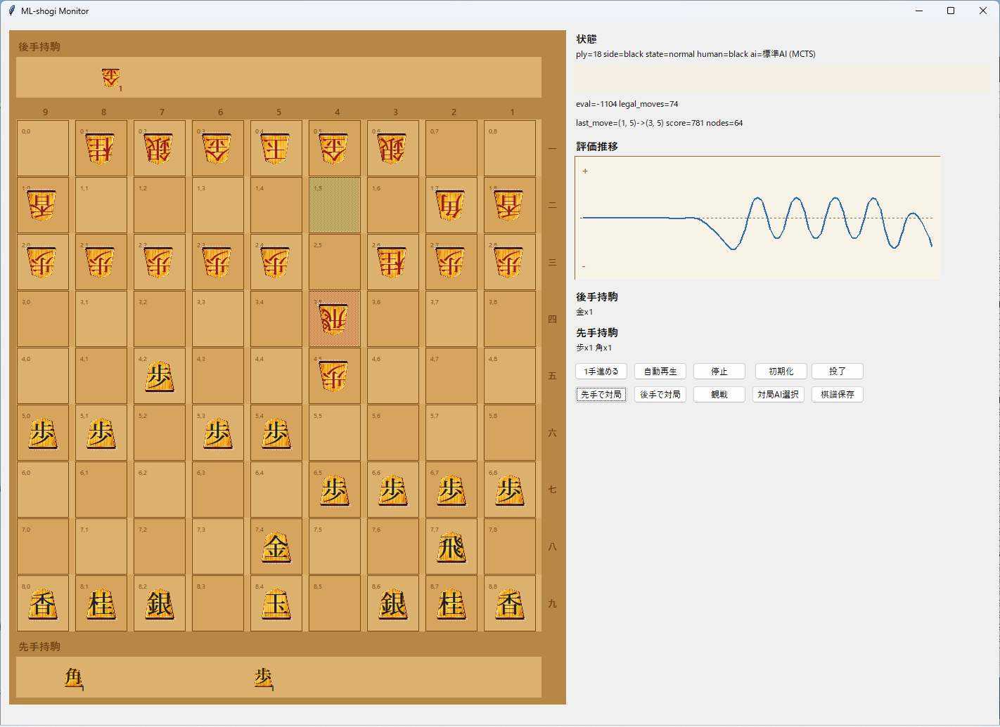
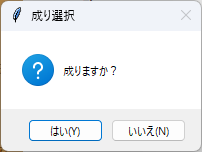
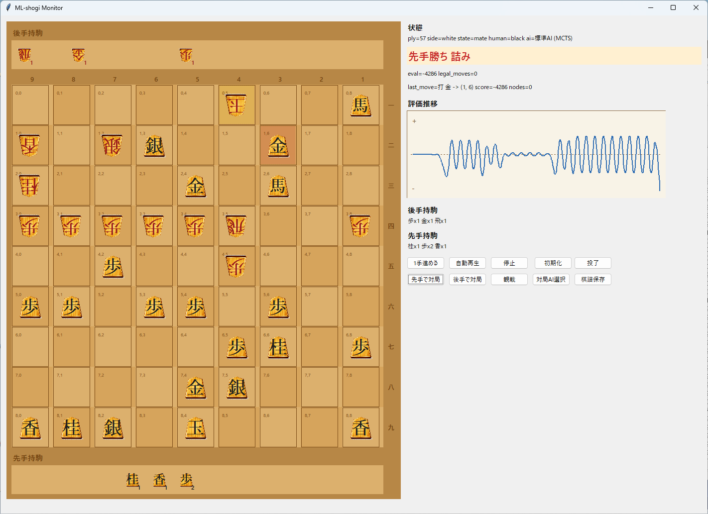

+++
title = 'Pythonで将棋AIを作るならまずGUI｜実装した理由と設計'
date = 2026-03-18T00:00:00+09:00
draft = false
description = 'Pythonで将棋AIを作る際に、強化学習に入る前にGUIを実装した理由を解説。合法手確認や盤面検証、探索結果の可視化など、開発初期で役立つ設計と実装のポイントをまとめました。'
tags = ['Python', '将棋AI', '強化学習', 'GUI', 'Tkinter']
categories = ['プロジェクト']
+++

## 開発のきっかけ

この記事は、**「自前で将棋AIを作ろうプロジェクト」の第一弾**です。

将棋AIを作ろうとすると、
「まず何から作るべきか？」で悩むと思います。

強化学習、探索、評価関数あたりから入りたくなりますが、実際にはその前に、
「盤面が正しく動いているかを確認できる環境」
を作るのがかなり重要です。

この記事では、Pythonで将棋AIを作る第一歩として、強化学習に入る前にGUIを先に実装した理由と設計について解説します。

将来的には、強化学習で将棋AIを作ってみたいと思っています。

ただ、いきなり学習だけを回し始めても、

- 盤面が正しく更新されているのか
- 合法手生成が壊れていないか
- 成りや持ち駒の扱いが想定通りか
- 探索結果がそれっぽく動いているか

を確認しづらいです。

ログだけ見て追うやり方もありますが、将棋みたいにルールが多いゲームではやはり盤面を直接見られる方が早い。ということで、この「自前で将棋AIを作ろうプロジェクト」の第一歩として、まずは将棋GUIを作りました。

## 最終目標は「自前の強化学習将棋AIを育てること」

今作っている `ML-shogi` では、単に「将棋が動くプログラム」を作りたいわけではなく、

1. 将棋ルールをコードで扱えるようにする
2. 盤面を特徴量に変換する
3. 自己対局で `(state, policy, value)` を集める
4. それをもとに方策・価値ネットワークを育てる
5. 最終的に探索と組み合わせて対局できるAIにする

という流れを目標にしています。

その意味でGUIは完成品ではなく、**学習基盤を人間が検証するための観測装置**に近い立ち位置です。

## 将棋AI開発でGUIを先に作った理由

強化学習のコードを書いていると、ボトルネックは「学習アルゴリズムそのもの」だけではありません。

- 合法手生成のバグ
- 打ち歩詰めや成り判定の抜け
- 千日手や入玉まわりの終局処理
- 評価値や探索結果の向きが逆になる問題
- 人間が見ると明らかにおかしい手をAIが選んでいるのに、ログだけだと気づきにくい問題

このあたりは、学習が弱いのか、ルール実装が壊れているのか、探索が悪いのかを切り分けるのが面倒です。

そこで、盤面・持ち駒・最終手・評価推移・対局状態を一画面で見られるGUIを先に作っておけば、将来の自己対局や学習結果の確認がかなり楽になるはずだと考えました。

## Python製の将棋GUIでできること

- 9x9 の盤面表示
- 先手/後手の持ち駒表示
- 人間 vs AI の対局
- AI 同士の自動対局観戦
- 最終手の強調表示
- 王手・詰み・投了など終局状態の表示
- 評価値の簡易グラフ表示
- `negamax` と `MCTS` の切り替え
- 棋譜の `.kif` 保存

見た目はこんな感じです。



盤面だけでなく、右側に状態表示、評価値、持ち駒、操作ボタン、評価推移グラフをまとめています。  
「いま何が起きているか」をなるべくログを読まなくても分かるようにしたかったので、観戦ツール寄りの構成にしました。

盤面上の駒画像には `koma.png` を使っています。

<p></p>

これは生成AIで作った画像です。もうちょっと本物の将棋駒っぽい質感にしたかったのですが、今回はひとまず使える見た目になったところで妥協しました。  
とはいえ、GUIの操作感を確認する用途としては十分だったので、まずはこの画像で進めています。

## 将棋GUIで特に欲しかった確認ポイント

### 1. 合法手が直感どおりに選べること

人間側で駒をクリックしたとき、移動可能なマスだけが候補として出るようにしています。  
これで「その局面で本当にその手が合法なのか」を視覚的に確認できます。

持ち駒を打つ処理も含めて見られるので、将棋ルールの土台チェックとしてかなり便利です。

コードは例えばこんな感じで、GUI側では合法手生成の結果をそのまま使って移動候補を出しています。

```python
def _targets_from_square(position: Position, square: tuple[int, int]) -> set[tuple[int, int]]:
    return {
        move.to_square
        for move in generate_legal_moves(position)
        if move.from_square == square
    }
```

やっていること自体は単純で、あるマスを始点に持つ合法手だけを抜き出して、移動先の集合を作っているだけです。  
ただ、この「エンジン側の合法手生成をそのままGUIに流す」形にしておくと、表示と内部ロジックのズレが起きにくいので、将棋AI開発の初期段階ではかなり扱いやすいです。

### 2. 成りの扱いをその場で確認できること

成り・不成の両方がありえる局面では、ポップアップで選べるようにしました。



これを入れておくと、成り判定の境界がおかしくなっていないかを実際の操作で確認できます。  
学習前の段階では、こういう地味な確認が意外と大事です。

### 3. 終局状態を見逃さないこと

詰みや投了時は、終局が分かるように強めに表示しています。



終局判定そのものは内部ロジック側で持っていますが、GUI上でも見えていないと「本当に正しく終わったのか」が分かりにくい。  
詰み、千日手、入玉宣言勝ちは内部ロジックとしてすでに実装してあるので、GUI側ではそれらの終局状態を人間が確認しやすい形で見えるようにしています。

終局判定のコードも雰囲気としてはかなり素直で、合法手が残っているか、千日手か、入玉条件を満たしているかを順番に見ています。

```python
def terminal_result(position: Position) -> TerminalResult:
    entering_king = entering_king_declaration_result(position, position.side_to_move)
    if entering_king is not None:
        return entering_king

    if is_repetition(position):
        return TerminalResult(status=TerminalStatus.REPETITION, winner=None)

    legal_moves = generate_legal_moves(position)
    if legal_moves:
        return TerminalResult(status=TerminalStatus.ONGOING, winner=None)

    if is_in_check(position, position.side_to_move):
        return TerminalResult(
            status=TerminalStatus.CHECKMATE,
            winner=position.side_to_move.opponent.value,
        )
    return TerminalResult(status=TerminalStatus.STALEMATE, winner=None)
```

このあたりを GUI 上で即確認できるようにしておくと、「終局判定の実装が正しいか」と「その結果の見せ方が分かりやすいか」を同時に潰せます。

## 中身は「見た目」より「将棋AIの検証しやすさ」重視

今回のGUIは Tkinter ベースで、見た目の豪華さよりもまずは開発速度と検証効率を優先しています。

内部では、

- 将棋の盤面状態
- 合法手生成
- 局面評価
- `negamax` 探索
- `MCTS` による探索
- 自己対局用の状態遷移

といったAI側の処理を同じコードベースで使い回しています。

つまりこのGUIは、単なる「盤面を表示するアプリ」ではなく、今後の強化学習や自己対局の挙動確認にもそのまま使う前提のフロントエンドです。

## 将棋AI開発の初期段階でよかった点

- ルール実装の違和感に早く気づける
- AIの手が弱いのか、そもそも探索や終局判定が怪しいのかを切り分けやすい
- 自己対局や学習結果をあとで可視化する土台になる
- 棋譜保存があるので、気になった局面を後から追いやすい

特に「強化学習に入る前の将棋エンジン確認ツール」としてはかなり有効でした。  
見えているだけで、デバッグの心理的ハードルがかなり下がります。

## 今後やりたいこと

- 学習済みチェックポイントをGUIから切り替えて対局できるようにする
- 自己対局の進行状況や勝率をもっと見やすくする
- 評価推移だけでなく、候補手や探索回数も表示する
- 棋譜の読み込み対応
- 強化学習で育ったモデルと人間が対局しやすい形に整える

最終的には、「将棋GUIを作った」で終わりではなく、ここから自己対局と学習を回して、少しずつ自前の将棋AIとして形にしていきたいと思っています。

## まとめ

自前で将棋AIを作るつもりなら、いきなり学習コードだけを書くより、先に盤面をちゃんと見られる環境を作っておく方がたぶん楽です。

今回作った将棋GUIは、そのための土台であり、**「自前で将棋AIを作ろうプロジェクト」の第一弾**でもあります。  
将棋AI本体より一見地味ですが、合法手、成り、持ち駒、終局、探索結果を人間が直接確認できる環境があるだけで、後の開発がかなり進めやすくなります。

次はこの土台の上で、評価関数を自作して、強化学習なしの状態でどこまで戦えるかを試す予定です。

要するに第二弾は、**「評価関数を自作して強化学習0で対戦してみる」** になります。

その先では、どれだけ学習させたら自分（将棋ウォーズ初段）が敵わなくなるのか、そしてそこまで本当に自力で学習させられるのかを試してみたいと思っています。  
今回は外部の棋譜や定石は学習させない前提なので、かなり遠回りになるはずですが、そのぶんどこまで伸びるのかは普通に楽しみです。

## 関連記事

- [Selenium使用時にChromeDriverを自動更新する方法](/blog/get-chrome-driver-python/)
- [音楽の音量を自動調整するツールをPythonで作る LUFS正規化開発ログ](/blog/mp3-lufs-normalizer-python/)
- [Power Automateで前月分をSharePoint→Excelへ送るときの落とし穴](/blog/power-automate-sharepoint-excel/)
